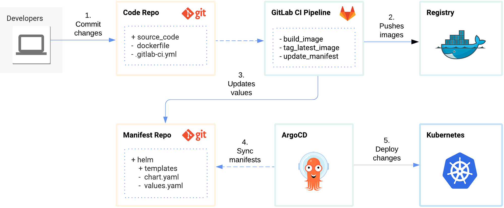
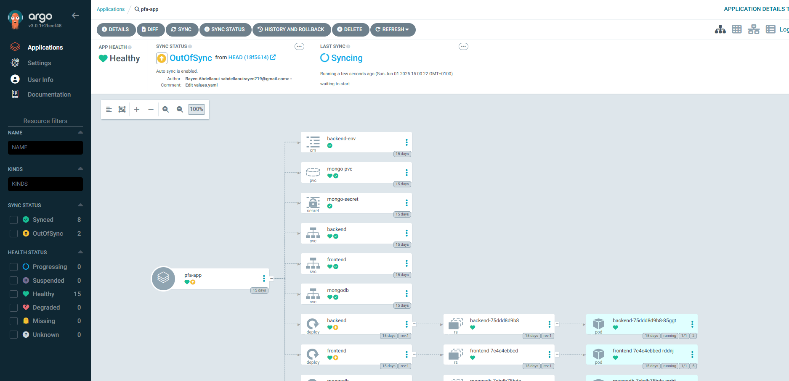
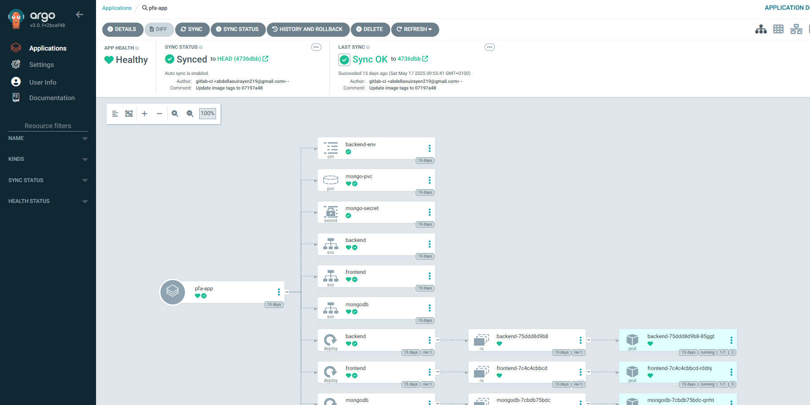
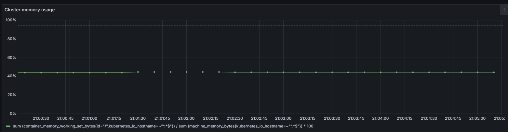
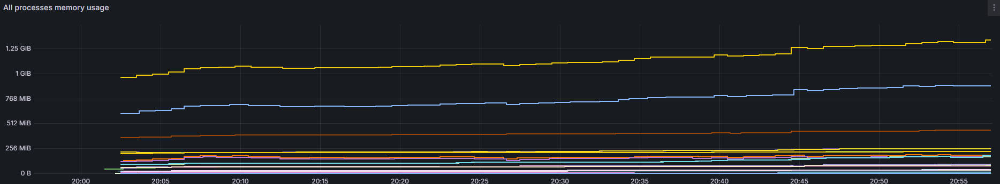

# 🚀 Continuous Deployment Driven by GitOps with Kubernetes and ArgoCD



This repository contains the **Helm chart** and **ArgoCD configuration** for deploying **WorkShopWise** to a Kubernetes cluster using a **GitOps approach**.  

The goal is to enable fully automated and declarative continuous deployment:  
- **Helm** → packages the Kubernetes manifests for WorkShopWise  
- **ArgoCD** → manages GitOps-driven deployment, syncing the cluster state with this Git repo  

---

## 📌 Project Overview

**WorkShopWise** is a novel Web Platform for Simultaneous Workshop Session Booking considering Scalability Challenges using React Js, Express and MongoDB.  

In this repo:  
- `charts/` → Helm chart for WorkShopWise  
- `argocd/` → ArgoCD `Application` manifests to deploy the chart  
- Kubernetes cluster state is automatically synced via GitOps  

---

## ⚙️ Requirements

Make sure you have:  

- A running [Kubernetes](https://kubernetes.io/) cluster  
- [kubectl](https://kubernetes.io/docs/tasks/tools/) installed and configured  
- [Helm v3+](https://helm.sh/docs/intro/install/) installed  
- [ArgoCD](https://argo-cd.readthedocs.io/) installed in your cluster  

---

## 🚀 Deployment Flow

1. **ArgoCD monitors this repository**  
   - Any changes to `charts/` or `values.yaml` trigger an automatic sync  

2. **Helm manages the app manifests**  
   - Backend, frontend, database, ingress, and services  

3. **Kubernetes applies the desired state**  
   - Cluster state always matches Git  

---

## 📂 Repository Structure

- ``pfa/Chart.yaml`` → Metadata for the Helm chart
- ``pfa/values.yaml`` → Default configuration values for the chart
- ``pfa/templates/`` → Kubernetes manifest templates that Helm fills with values.
- ``argocd-app.yml`` → ArgoCD application definition to deploy the Helm chart
- ``README.md``
---

## ⚙️ Helm Deployment (without GitOps)

If you want to deploy manually with Helm:

```bash
helm install workshopwise ./pfa
````

## 🤖 GitOps Deployment with ArgoCD

1. **Create a namespace for ArgoCD :**

```bash
kubectl create namespace argocd
````

2. **Apply the ArgoCD Application manifest :**
```bash
kubectl apply -f argocd-app.yml -n argocd
````
3. **ArgoCD syncs automatically :** 

The argocd-app.yml points to this repo and the Helm chart path.

Cluster resources will be deployed/updated automatically.

4. **Continuous Integration :**

The CI pipeline is configured in [GitLab CI Pipeline](https://gitlab.com/Rayen-Abdellaoui/Application-to-deployment/-/blob/main/.gitlab-ci.yml?ref_type=heads) to build and push images automatically.

---
## ArgoCD Dashboard

Here are some screenshots of ArgoCD in action:

**1. Application Out-Of-Sync Status**  


**2. Application Sync Status**  


## 📊 Monitoring with Prometheus and Grafana

To monitor WorkShopWise in your Kubernetes cluster, we use **Prometheus** for metrics collection and **Grafana** for visualization.

### 1. Prometheus

- Collects metrics from Kubernetes, WorkShopWise pods, and services.  
- Can be installed via Helm:
```bash
helm repo add prometheus-community https://prometheus-community.github.io/helm-charts
helm repo update
helm install prometheus prometheus-community/prometheus
````
### 2. Grafana

 - Visualizes metrics collected by Prometheus.
 - Can be installed via Helm:
```bash
helm repo add grafana https://grafana.github.io/helm-charts
helm repo update
helm install grafana grafana/grafana
````
### 3. Access Grafana dashboard
```bash
kubectl port-forward svc/grafana 3000:80
````
Open http://localhost:3000
### 4. Example Dashboards




